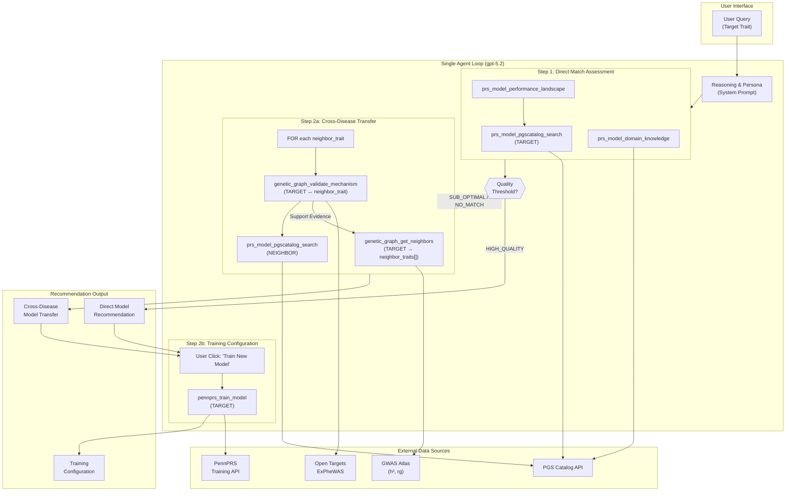

# Standard Operating Procedure

## Target Journal: Nature Genetics

## Brainstorming

- Focus on PRS model recommendation applications.
- If there is matched diseases, select the best one.
- If there is no matched disease, we can (i) selected genetically related diseases (one or more); (2) train the model on PennPRS. 
- We may use h2, genetic correlation, and base model embedding information to first build a knowledge graph among diseases. How to weight these resources? 
- Need validation, All of US? 
- Write initial version of prompts (i) same disease (ii) cross diseases, talking with GPT for design, and we can further refine. 
- Start with some selected diseases (cancer, mental diseases, neurodegenetive diseses, heart diseases) to build up the pipeline.

## LLM Agentic Engineering Knowledge Base

**To ensure the autonomy and reliability of the single llm agent system, this project must strictly adhere to the engineering standards detailed in the following documentation, each of which MUST be read in its entirety:**

- [Anthropic: Long-Running Agents](../knowledge/context_engineering/anthropic_long_running_agents.md)
- [Anthropic: Effective Context Engineering](../knowledge/context_engineering/anthropic_context_engineering.md)
- [Manus: Context Engineering](../knowledge/context_engineering/manus_context_engineering.md)

## Objective

The core objective is to evolve the **PRS (Polygenic Risk Score) Model Recommendation System** beyond simple direct matching by leveraging genetic architecture to enable intelligent cross-disease recommendations.

- **Recommendation Logic (Sequential Workflow)**:
    - **Step 1: Direct Match Assessment**: Search for existing models for the target disease.
        - *High-Quality Match*: If models exist and pass the quality threshold, recommend the best-performing one. **Always offer Direct Training as a follow-up option.**
        - *Sub-optimal Match*: If models exist but fail the quality threshold, recommend the best available as a baseline and **proceed to Step 2**.
        - *No Match*: If no direct models exist, **proceed to Step 2**.
    - **Step 2: Augmented Recommendation**: Triggered when direct models are insufficient or missing.
        - *Cross-Disease Transfer*: Discover **genetically related diseases** using the Knowledge Graph and provide biological validation for the correlation to support model transfer decisions.
        - *On-Demand Training*: Regardless of the recommendation outcome, the system always provides a "Direct Training" option at the end of the report. The **PennPRS** training pipeline is only initiated after explicit user interaction.
    - **Automation Note**: The recommendation generation (Steps 1 and 2) is **fully autonomous**. The training pipeline (PennPRS) is **on-demand**, triggered by explicit user confirmation from the recommendation report.

- **Product Vision & Benchmarking**:
    - **Positioning**: This system benchmarks against the world's most powerful Generative LLMs (**ChatGPT, Claude, Gemini**), but is specifically engineered and optimized for the **PRS domain**.
    - **User Experience**: The interaction model mirrors the simplicity of leading AI assistants—users simply input a query into a search bar. Behind the scenes, the **LLM Agent** autonomously orchestrates reasoning, tool calls, and data retrieval to deliver a "fine-dining" (precision-crafted) response.
    - **Differentiator**: Unlike general-purpose LLMs that typically return text, links, or videos, our system provides:
        1. **Direct Model Access**: Immediate delivery of the specific PRS models.
        2. **Evidence-Based Context**: A curated selection of related models backed by genetic evidence (rg/h2).
        3. **Seamless Integration**: The ability for users to directly apply and execute these models within the **PennPRS** ecosystem.

- **Disease Knowledge Graph**: Build a "brain" for the system using:
    - **h² (Heritability)**: To understand the genetic contribution to the trait.
    - **Genetic Correlation (rg)**: To quantify the pleiotropy and shared genetic risk between diseases.
    - **Base Model Embeddings (HOLD)**: To find mathematical similarities between existing PRS models.

- **Validation**: Utilize the **All of Us** cohort (NIH research program) as the gold standard to validate the performance of recommended models.

- **LLM Strategy (Co-Scientist Expert Persona)**: The platform is engineered as a **specialized Co-Scientist** rather than a generic assistant.
    - **Core Philosophy**: **Context-Driven Scientific Reasoning.** The Agent achieves expert-level performance by using tools to dynamically construct a **"Scientific Reasoning Context"**. Instead of relying solely on internal weights, it actively fetches **Scientific Standards and Evidence** (e.g., theoretical limits, statistical baselines, expert consensus) to **guide discovery, evaluate quality, and orchestrate execution**. This enables the Agent to act as a rigorous intellectual partner capable of navigating complex research workflows independently, rather than merely verifying isolated facts.
    - **Management Constraint**: All system prompts must be centralized in a **single file** to facilitate management and version control.

## Architecture

### Immutable Architectural Constraint: Single Agent Loop

To achieve the "Co-scientist" level of autonomy and reasoning, the system **MUST** be built as a **Single Agent Architecture** (powered by **gpt-5.2**). The agent acts as a unified central brain, utilizing **Dynamic Planning** and **Tool-Augmented Generation** to navigate the complex recommendation workflow within a **single persistent conversation state**. Multi-agent delegation or sub-agent hierarchies are strictly prohibited to maintain persona integrity and state coherence.

### Architecture Diagram

> **Rendered SVG**: See [architecture.svg](architecture.svg) (generated via [pretty-mermaid](../../.agent/skills/pretty-mermaid-skills/SKILL.md) with `tokyo-night` theme)



### Tool Sets Overview

The agent's capabilities are organized into **three external Tool Sets** (Action Space) and one internal **Reasoning & Persona** (Cognitive Space):

- **PRS Model Tools**:
    <!-- For direct model searching, metadata retrieval, and model filtering/selection. -->
    - **`prs_model_pgscatalog_search`**: Searches for trait-specific PRS models and retrieves full metadata.
        - *Purpose*: To retrieve all available PRS models associated with a specific trait and return comprehensive metadata fields, providing the full raw data required for downstream filtering and evaluation.
    - **`prs_model_domain_knowledge`**: Queries a **constrained set of authoritative websites** (not local RAG) to fetch *Clinical Guidelines and Review Papers*.
        - *Purpose*: To enable the LLM to acquire extensive PRS knowledge and become a PRS expert, ensuring it can excellently perform PRS model selection tasks. The search scope is restricted to a curated whitelist of web pages to avoid unbounded context pollution.
    - **`prs_model_performance_landscape`**: Calculates statistical distributions across all retrieved candidate models.
        - *Purpose*: To provide a holistic performance landscape for the entire pool of retrieved models, enabling the LLM Agent to statistically distinguish and select candidates based on their standing within the global distribution.

- **Genetic Graph Tools**:
    <!-- For traversing Knowledge Graphs ($h^2$, $r_g$) and providing scientific validation. -->
    - **`genetic_graph_get_neighbors`**: Traverses the Knowledge Graph to find **genetically correlated traits**, pre-ranked by transfer viability score ($r_g^2 \times h^2$).
        - *Purpose*: To identify and prioritize traits that share a significant genetic basis with the target trait, providing **ranked** candidates for cross-disease model recommendation. The deterministic ranking (genetic overlap weighted by signal strength) is applied automatically to avoid unnecessary tool call overhead.
    - **`genetic_graph_verify_study_power`**: Fetches detailed study-pair metadata (sample sizes, cohorts, populations) for a specific genetic correlation edge.
        - *Purpose*: To provide JIT context on the underlying statistical evidence of a correlation when the Agent needs to perform deep quality control on a specific cross-disease link. Loaded on-demand, not during initial neighbor discovery.
    - **`genetic_graph_validate_mechanism`**: Cross-references shared genetic loci/genes (via [Open Targets](https://platform.opentargets.org) and [ExPheWAS](https://exphewas.statgen.org)) to provide biological rationale for the correlation. **This tool is the Agent's "Biological Translator".**
        - *Purpose*: The essence of this tool is to transform "statistical correlation" into "biological causal logic". When the system discovers that two diseases (e.g., Crohn's disease and Ulcerative colitis) have high genetic correlation ($r_g$), this tool digs into the underlying biological evidence:
            1. **Find shared loci/genes**: By interfacing with both [Open Targets](https://platform.opentargets.org) and [ExPheWAS](https://exphewas.statgen.org), identify which specific genes or genetic loci jointly control both diseases.
            2. **Construct explanatory context**: It provides not just a number, but an "evidence list". For example: "Both diseases share the pathogenic pathway of the IL23R gene."
            3. **Justify model transfer**: If the Agent wants to apply Disease A's PRS model to Disease B, the "biological mechanism evidence" from this tool is the strongest justification. It transforms the Agent's decision from "blind attempt" to "evidence-based scientific inference".
        - *Summary*: It is the Agent's "biological translator", responsible for proving that cross-disease model recommendations are scientifically grounded in life science principles.

- **PennPRS Tools**:
    <!-- For interfacing with the PennPRS backend for model training configuration. -->
    - **`pennprs_train_model`**: Generates a **recommended training configuration** based on the Agent's reasoning context (target trait, available GWAS data, recommended method, parameters).
        - *Purpose*: To prepare a pre-filled training request form for user review. The Agent synthesizes its scientific judgment into actionable configuration values. **This tool is triggered by explicit user action from any recommendation output.**
        - *Output*: JSON configuration object displayed in the UI as an editable form.
        - *Interaction Model*: **Human-in-the-Loop** — Agent proposes the configuration upon user request, user reviews/modifies if needed, then submits via UI action.

- **Reasoning & Persona (System Prompt)**: The cognitive core of the agent, implemented as a structured system prompt that:
    - **Encodes the Sequential Workflow**: Instructs the LLM to navigate Step 1 (Direct Match Assessment) → Step 2 (Augmented Recommendation) decision logic autonomously.
    - **Constructs the Evaluation Reference Frame**: Dynamically assembles scientific standards using `prs_model_domain_knowledge` (Clinical Consensus) and `prs_model_performance_landscape` (Market Statistics) to guide quality judgments.
    - **Maintains Co-Scientist Persona**: Ensures all responses are reasoned, evidence-backed, and reflect the specialized scientific partner voice.
    - **Manages Attention via Recitation**: Uses structured scratchpad/todo tracking to push critical objectives into the LLM's recent attention span.

## Implementation Plan

1.  **Phase 1: Foundation**

    - **Module 1: PGS Catalog Data Schema**: Define the data interface and metadata extraction for PGS models.

    - **Module 2: Knowledge Graph**: Integrate `genetic_correlation` and `heritability` into a discovery system for **genetically correlated traits**.

2.  **Phase 2: Agent Core**

    The following engineering constraints are **mandatory** (derived from LLM Agentic Engineering Knowledge Base):

    - **Module 3: Tools**
        - Wrap **PRS Model, Genetic Graph, and PennPRS** functionalities as callable tool interfaces using `domain_action` prefixing.
        - **Static Tool Binding with Masking**: All tools defined at session start; availability controlled via logit masking, not dynamic injection. *(Manus: Mask, Don't Remove)*
        - **Consistent Tool Naming**: Use standardized domain prefixes (e.g., `prs_model_*`, `genetic_graph_*`, `pennprs_*`) for efficient logit mask grouping. *(Manus: Prefix-Based Action Selection)*
        - **Self-Contained & Robust**: Each tool must be error-tolerant with unambiguous input/output schemas. *(Anthropic: Tool Design)*
        - **Minimal Viable Tool Set**: Curate the smallest set covering functionality; avoid ambiguous decision points. *(Anthropic: Tool Curation)*
        - **JIT Context Loading**: Tools return lightweight references (IDs, paths); full data loaded on-demand. *(Anthropic: Just-in-time context strategies)*
        - **File System as Context (Large Observations)**: Large tool observations MUST be persisted to disk and referenced by stable paths/IDs, not injected verbatim into the LLM context. *(Manus: Use the File System as Context)*
            - **Rule**: If a tool output exceeds a configured size threshold (e.g., >50KB JSON or >2,000 tokens equivalent), the tool MUST:
                1. Persist the full payload to a file (under `output/agent_artifacts/` or an equivalent runtime artifact directory).
                2. Return a compact in-context summary plus a **stable reference**: `{artifact_id, artifact_path, sha256, content_type, bytes, summary}`.
            - **Restorable Compression**: Context compaction MUST be reversible by preserving the `artifact_path` (and `url` when applicable). Never discard the reference.
            - **Human-safe**: Artifact paths must never include secrets; redact tokens/credentials before writing.
        - **Append-Only Context**: Serialize tool results deterministically; no mid-loop modification to preserve KV-cache. *(Manus: Design Around the KV-Cache)*
        - **Stable Prompt Prefix (KV-cache)**: Keep the system prompt + tool definitions prefix **bitwise stable** across turns/sessions. Avoid any dynamic tokens at the beginning of the prompt (e.g., timestamps, random IDs, run counters). *(Manus: Design Around the KV-Cache)*
            - **Hard rule**: Never include "Current time", "Today is ...", or per-request metadata in the system prompt header. If time is needed, retrieve it via a tool and place it in the append-only observation stream.
            - **Deterministic serialization**: For JSON-like tool outputs, enforce stable key ordering and canonical formatting (e.g., sorted keys, stable float rounding policy, stable whitespace).
        - **Cache Breakpoints (Optional)**: If the serving stack supports explicit cache breakpoints, place a breakpoint **after** the stable prefix (system prompt + tool schemas) and avoid moving it. *(Manus: Design Around the KV-Cache)*
        - **Error Trace Retention**: Failed tool calls remain in history as explicit feedback; no retry-and-hide. *(Manus: Keep the Wrong Stuff In)*

    - **Module 4: System Prompt**
        - **Persona Definition**: Define the Co-scientist Expert voice, tone, response patterns, and boundaries (what it will/won't do).
        - **Plan-and-Solve Decision Logic**: Develop the **gpt-5.2** prompt encoding the Sequential Workflow (L27-35) as structured decision steps with explicit transition conditions.
        - **Evaluation Reference Frame Construction**: Specify how the agent combines outputs from `prs_model_domain_knowledge` and `prs_model_performance_landscape` to form quality judgment criteria.
        - **Tool Orchestration Protocol**: Define the logical flow for selecting and chaining tools. Specifically, guide the agent to use `genetic_graph_validate_mechanism` as a biological validator for traits discovered via `genetic_graph_get_neighbors`.
        - **Human-in-the-Loop Integration**: Define how the agent provides the "Train New Model" option at the end of every recommendation report, waiting for user interaction before calling `pennprs_train_model`.
        - **Scratchpad/State Format**: Define the `todo.md` style internal state tracking format for workflow progress. *(Manus: Manipulate Attention Through Recitation)*
        - **Output Report Templates**: Define JSON/Markdown templates for recommendation reports with required fields and evidence citations.
        - **Error Recovery Protocol**: Specify agent behavior when tools fail (retry logic, fallback strategies, escalation to human).
        - **Prompt Altitude**: Write at the right abstraction level; avoid hardcoding brittle logic or vague guidance. *(Anthropic: Right Altitude)*

## Implementation Log

### Module 1 - PGS Catalog Data Schema

#### PGS Catalog Models Available Fields
Based on `src/server/core/pgs_catalog_client.py` and `pgscatalog/PGS_Catalog/rest_api/serializers.py`, the following fields are available from the PGS Catalog API. 

**Target Classification**: `[Agent + UI]` fields are serialized into the LLM context for scientific reasoning, whereas `[UI Only]` fields are passed exclusively to the frontend for comprehensive model detail presentation to minimize agent context noise.

| Field Name (API Key) | Example1 | Example2 | Description | Source | Target |
| :--- | :--- | :--- | :--- | :--- | :--- |
| **`id`** | PGS000831 | PGS000018 | Unique Model ID | Score | [Agent + UI] |
| **`name`** | Total_cholesterol_PGS | metaGRS_CAD | Model display name | Score | [UI Only] |
| **`trait_reported`** | Total cholesterol | Coronary artery disease | Original reported trait | Score | [Agent + UI] |
| **`trait_additional`** | null | null | Additional trait information | Score | [UI Only] |
| **`trait_efo`** | total cholesterol measurement | coronary artery disease | EFO Ontology mappings | Score | [Agent + UI] |
| **`method_name`** | Pruning of FDR filtered SNPs | metaGRS | Algorithm used (e.g. LDpred2) | Score | [Agent + UI] |
| **`method_params`** | FDR < 5%, r^2 < 0.2 | metaGRS log(HR) mixing... | Parameters used in the method | Score | [UI Only] |
| **`variants_number`** | 1,032 | 1,745,179 | Count of variants in model | Score | [Agent + UI] |
| **`variants_interactions`** | 0 | 0 | Variant interactions info | Score | [UI Only] |
| **`variants_genomebuild`** | hg19 | hg19 | Genome build (e.g. GRCh37) | Score | [UI Only] |
| **`weight_type`** | beta | NR | Type of weights used | Score | [UI Only] |
| **`ancestry_distribution`** | GWAS: EUR (100%) | GWAS: AFR (100%) | Detailed ancestry breakdown | Score | [Agent + UI] |
| **`publication`** | Genetic Predisposition Impacts... | Genomic Risk Prediction of... | Publication metadata | Score/Performance | [Agent + UI] |
| **`date_release`** | 2021-07-29 | 2019-10-14 | Date the score was released | Score | [Agent + UI] |
| **`license`** | CC BY-NC-ND 4.0 | PGS obtained from the... | Usage license | Score | [UI Only] |
| **`ftp_scoring_file`** | https://ftp.ebi.ac.uk/... | https://ftp.ebi.ac.uk/... | URL to original scoring file | Score | [UI Only] |
| **`ftp_hm_scoring_files`** | GRCh37, GRCh38 URLs | GRCh37, GRCh38 URLs | URL to harmonized scoring files | Score | [UI Only] |
| **`matches_publication`** | True | True | Flag if score matches publication | Score | [UI Only] |
| **`samples_variants`** | n=283,785 | n=382,026 | Samples used for variant selection | Score | [UI Only] |
| **`samples_training`** | n=0 | n=3,000 | Samples used for training | Score | [Agent + UI] |
| **`performance_metrics`** | R²: 0.087, AUC: 0.78 | HR: 1.71, AUC: 0.81 | Metrics (AUC, R2, etc.) | Performance | [Agent + UI] |
| **`phenotyping_reported`** | Total cholesterol | Incident coronary artery disease | Phenotype description in validation | Performance | [Agent + UI] |
| **`covariates`** | Age, sex, PCs(1-7), season | sex, genetic PCs (1-10)... | Covariates used in validation | Performance | [Agent + UI] |
| **`sampleset`** | null | null | Sample set used for validation | Performance | [Agent + UI] |
| **`performance_comments`** | null | null | Additional performance notes | Performance | [UI Only] |
| **`associated_pgs_id`** | PGS000831 | PGS000018 | The PGS ID associated with performance | Performance | [UI Only] |

#### Agent Context Injection

The structured metadata fields above provide the foundational evidence for evaluation. The agent utilizes **JIT Context Loading** to dynamically construct a **Scientific Reasoning Context**—transforming lightweight model references into a rigorous evaluation frame by fetching clinical benchmarks, performance landscapes, and expert consensus to guide scientific judgment.

**Target Classification**: The `[Agent + UI]` fields in the table above are serialized into the LLM context for scientific reasoning, whereas `[UI Only]` fields are passed exclusively to the frontend for comprehensive model detail presentation to minimize agent context noise.

**Combined Results Workflow**:
1. `prs_model_pgscatalog_search` returns fields with Target `[Agent + UI]`.
2. **Hard-coded pre-filtering**: Remove models where AUC & R² are all empty (no performance data).
3. **Combined context injection**: The filtered search results, `prs_model_domain_knowledge` results, and `prs_model_performance_landscape` results are returned to the LLM **simultaneously**.
4. **LLM Decision**: The Agent makes a determination of **High-Quality Match / Sub-optimal Match / No Match**.

**Open Question**: For different Traits, should we implement different filtering standards, or trust that the LLM has this capability? (To be determined during implementation.)

#### Implementation Status

- **Implemented**: 
    - `PGSCatalogClient` for API queries.
    - `QualityMetrics` data schema (Pydantic model matching `shared/contracts/api.ts`).
    - `QualityEvaluator.extract_metrics()` for structured metadata extraction from raw API responses.
- **Not Implemented**:
    - #### Agent Context Injection

### Module 2 - Knowledge Graph Definition

#### GWAS Atlas Data Schema

Based on `data/heritability/gwas_atlas/gwas_atlas.tsv` and `data/genetic_correlation/gwas_atlas/gwas_atlas_gc.tsv`, the following fields are available for constructing the Knowledge Graph.

##### 1. Heritability Dataset (`data/heritability/gwas_atlas/gwas_atlas.tsv`)

| Field Name | Description | Note |
| :--- | :--- | :--- |
| **`id`** | Internal GWAS Atlas numeric ID for the study | |
| **`PMID`** | PubMed Identifier of the publication | |
| **`Year`** | Year of publication | |
| **`File`** | Link or name of the source summary statistics file | |
| **`Website`** | Source website for the data | |
| **`Consortium`** | Research consortium (e.g., PGC, UKB) | |
| **`Domain`** | Top-level trait category (e.g., Psychiatric) | |
| **`ChapterLevel`** | ICD-10 based chapter classification | |
| **`SubchapterLevel`** | Specific subchapter classification | |
| **`Trait`** | Human-readable trait name | Used for labeling nodes |
| **`uniqTrait`** | **Primary Key**. Unique string identifier for the trait-study pair | Links to GC dataset |
| **`Population`** | Ancestry composition of the cohort | Default: EUR |
| **`Ncase`** | Number of cases (for binary traits) | |
| **`Ncontrol`** | Number of controls (for binary traits) | |
| **`N`** | **Total Sample Size**. Total number of individuals | Key for study prioritization |
| **`Genome`** | Genome build (e.g., hg18, hg19) | |
| **`Nsnps`** | Number of SNPs used in the heritability analysis | |
| **`Nhits`** | Number of genome-wide significant hits reported | |
| **`SNPh2`** | **Observed scale SNP heritability ($h^2_{obs}$)** | Main node attribute |
| **`SNPh2_se`** | Standard error of $h^2_{obs}$ | |
| **`SNPh2_z`** | **Z-score of $h^2_{obs}$ ($h^2\_Z$)** | Used for heritability validity |
| **`SNPh2_l`** | Liability scale SNP heritability ($h^2_{lia}$) | |
| **`SNPh2_l_se`** | Standard error of $h^2_{lia}$ | |
| **`LambdaGC`** | Genomic inflation factor ($\lambda_{GC}$) | |
| **`Chi2`** | Mean $\chi^2$ statistic | |
| **`Intercept`** | LD Score Regression intercept | |
| **`Note`** | Additional notes (e.g., population prevalence used for liability scale) | |
| **`DateAdded`** | Date the record was added to GWAS Atlas | |
| **`DateLastModified`** | Date of last record update | |

##### 2. Genetic Correlation Dataset (`data/genetic_correlation/gwas_atlas/gwas_atlas_gc.tsv`)

| Field Name | Description | Note |
| :--- | :--- | :--- |
| **`id1`** | Identifier for Trait 1 | Corresponds to `id` in Heritability TSV |
| **`id2`** | Identifier for Trait 2 | Corresponds to `id` in Heritability TSV |
| **`rg`** | **Genetic Correlation Coefficient ($r_g$)** | Primary edge weight |
| **`se`** | Standard error of $r_g$ | |
| **`z`** | Z-score of $r_g$ | |
| **`p`** | **P-value of $r_g$** | Used for significance filtering |
| **`gcov_int`** | Genetic covariance intercept | |
| **`gcov_int_se`** | Standard error of the intercept | |

#### Data Reality Analysis

The GWAS Atlas datasets form a natural graph structure, but with a critical nuance:

| Dataset | Format | Granularity |
|:---|:---|:---|
| Heritability | Node list | **Study-level** (each row = one Study) |
| Genetic Correlation | Edge list | **Study-pair-level** (each edge = one Study1-Study2 pair) |

**Critical Insight**: The `id` in both datasets refers to **Study**, not **Trait**. The same Trait can have multiple Studies:

| Trait | Study Count |
|:---|:---:|
| High-density lipoprotein cholesterol | 31 |
| Waist-hip ratio | 30 |
| Body Mass Index | 25 |
| Schizophrenia | 4 |

This means a single Trait-pair (e.g., HDL vs BMI) may have up to 31 x 25 = 775 edges at the Study level.

#### Graph Schema: Trait-Centric with Study Provenance

**Design Principle**: Each Trait has exactly **ONE node**, but retains **ALL Study information** as provenance.

##### Node Schema (Traits)

| Attribute | Type | Description |
|:---|:---|:---|
| `trait_id` | string | Canonical trait name (`uniqTrait`). **Primary Key**. |
| `domain` | string | Top-level category (e.g., Psychiatric) |
| `chapter_level` | string | ICD-10 chapter classification |
| `h2_meta` | float | **Meta-analyzed $h^2$** (inverse-variance weighted) |
| `h2_se_meta` | float | SE of meta-analyzed $h^2$ |
| `h2_z_meta` | float | Z-score of meta-analyzed $h^2$ |
| `n_studies` | int | Number of Studies aggregated |
| `studies` | array | All Studies for this Trait (full provenance) |

- **Data Source**: `src/server/modules/heritability/gwas_atlas_client.py`
- **Study Provenance**: Each element in `studies` contains `{study_id, pmid, year, population, n, snp_h2, snp_h2_se, snp_h2_z, consortium, ...}`.
- **NA Handling**: Studies without valid $h^2$ estimates are excluded from meta-analysis but retained in provenance.

##### Edge Schema (Genetic Correlations)

| Attribute | Type | Description |
|:---|:---|:---|
| `source_trait` | string | Source trait canonical name |
| `target_trait` | string | Target trait canonical name |
| `rg_meta` | float | **Meta-analyzed $r_g$** (inverse-variance weighted) |
| `rg_se_meta` | float | SE of meta-analyzed $r_g$ |
| `rg_z_meta` | float | Z-score of meta-analyzed $r_g$ |
| `rg_p_meta` | float | P-value of meta-analyzed $r_g$ |
| `n_correlations` | int | Number of Study-pair correlations aggregated |
| `correlations` | array | All Study-pair correlations (full provenance) |

- **Data Source**: `src/server/modules/genetic_correlation/gwas_atlas_client.py`
- **Constraint**: No self-loops (edges between Studies of the same Trait are excluded).

##### Aggregation Strategy: Inverse-Variance Weighted Meta-Analysis

Both Node ($h^2$) and Edge ($r_g$) aggregation use the same fixed-effect meta-analysis formula:

$$\theta_{meta} = \frac{\sum_i w_i \cdot \theta_i}{\sum_i w_i}, \quad w_i = \frac{1}{SE_i^2}$$

$$SE_{meta} = \frac{1}{\sqrt{\sum_i w_i}}$$

$$Z_{meta} = \frac{\theta_{meta}}{SE_{meta}}, \quad P_{meta} = 2 \cdot \Phi(-|Z_{meta}|)$$

Where $\theta$ represents either $h^2$ (for nodes) or $r_g$ (for edges).

This approach:
- Weights estimates by precision (1/SE^2), giving more influence to well-powered studies.
- Provides a single, consolidated estimate per Trait (node) or Trait-pair (edge).
- Retains all individual estimates in `studies` (node) / `correlations` (edge) arrays for transparency.
- Maintains full provenance for reproducibility and sensitivity analysis.

#### Interaction Logic (Dynamic Service)

The Knowledge Graph is implemented as a **Virtual/Dynamic Graph**, constructed on-demand with Trait-level aggregation.

- **Input**: Target Trait (e.g., "Alzheimer's disease").
- **Graph Construction**:
    1. **Node Aggregation**: Group Studies by `uniqTrait`, apply inverse-variance weighted meta-analysis for $h^2$.
    2. **Edge Aggregation**: For each Trait pair, apply inverse-variance weighted meta-analysis for $r_g$.
    3. **Self-Loop Removal**: Exclude edges where source and target are the same Trait.
- **Traversal & Prioritization**: 
    1. Query neighbors where `|rg_z_meta| > 2` (Meta-analyzed $r_g$ significance, ~p < 0.05).
    2. Filter neighbors where `h2_z_meta > 2` (Meta-analyzed heritability validity).
    3. Rank neighbors by weighted score: **$r_{g,meta}^2 \times h^2_{meta}$** to favor traits that are both highly correlated and biologically viable for PRS transfer.
- **Output**: Prioritized list of **genetically correlated traits** to serve as search candidates for Module 1.

#### Implementation Status

- **Implemented (v1 - Study-Level, Legacy)**: 
    - `KnowledgeGraphService` with `GWASAtlasGCClient`.
    - Dynamic Graph Construction (Nodes/Edges).
    - Filter: `p < 0.05` significance threshold.
    - **Node Heritability**: `get_neighbors()` queries `GWASAtlasClient` and populates $h^2$ attributes.
    - **Weighted Scoring**: `get_prioritized_neighbors()` ranks neighbors by $r_g^2 \times h^2$ score.
    - **ID Mapping**: Bidirectional mapping via `get_trait_name_by_id()` and `get_trait_id_by_name()`.

- **Implemented (v2 - Trait-Centric with Meta-Analysis)**:
    - **Data Models**: `TraitNode`, `GeneticCorrelationEdgeMeta`, `TraitCentricGraphResult` with full schema per spec.
    - **Meta-Analysis Pipeline**: `inverse_variance_meta_analysis()` utility function implementing the formula.
    - **TraitAggregator**: Groups Studies by `uniqTrait`, applies meta-analysis, populates `h2_meta`, `h2_se_meta`, `h2_z_meta`, `n_studies`, `studies[]`.
    - **EdgeAggregator**: Groups Study-pairs by Trait-pair, applies meta-analysis, populates `rg_meta`, `rg_se_meta`, `rg_z_meta`, `rg_p_meta`, `n_correlations`, `correlations[]`.
    - **Self-Loop Removal**: Edges between Studies of the same Trait are excluded during aggregation.
    - **New Service Methods**:
        - `get_trait_node(trait_id)`: Returns `TraitNode` with meta-analyzed heritability.
        - `get_prioritized_neighbors_v2(trait_id, rg_z_threshold, h2_z_threshold)`: Trait-level prioritization with Z-score filtering.
        - `get_trait_centric_graph(trait_id)`: Returns complete `TraitCentricGraphResult`.
        - `get_edge_provenance(source_trait, target_trait)`: Returns detailed study-pair provenance for genetic correlation edges. Used by Module 3 `genetic_graph_verify_study_power` tool.
    - **Unified Filtering**: Uses `|rg_z_meta| > 2` and `h2_z_meta > 2` (Z-score based, consistent approach).

- **Not Implemented**:
    - None. Module 2 core functionality is complete.

### Module 3 - Tools

#### Tool Specifications

##### 1. PRS Model Tools

###### `prs_model_pgscatalog_search`

| Attribute | Specification |
|:---|:---|
| **Input** | `trait_query: str` — User's target trait (e.g., "Type 2 Diabetes", "Schizophrenia") |
| **Output** | `PGSSearchResult` — Filtered list of models with `[Agent + UI]` fields only |
| **Data Source** | PGS Catalog REST API (`/rest/score/search`) |
| **Dependency** | `PGSCatalogClient` (Module 1) |
| **Hard-coded Filter** | Remove models where `performance_metrics.auc` AND `performance_metrics.r2` are both null |
| **Ranking (Deterministic)** | Sort candidates by **AUC (desc)** → **R² (desc)** → **Training Sample Size (desc)** → **Variants (SNPs) (desc)** → **PGS ID (asc)**, then return top-N |
| **Token Budget** | ~500 tokens per model summary; max 25 models in initial response |

```python
# Output Schema
class PGSSearchResult:
    query_trait: str
    total_found: int
    after_filter: int
    models: list[PGSModelSummary]  # [Agent + UI] fields only (default top-25)

class PGSModelSummary:
    id: str                    # PGS000025
    trait_reported: str
    trait_efo: str
    method_name: str
    variants_number: int
    ancestry_distribution: str
    publication: str
    date_release: str
    samples_training: str
    performance_metrics: dict  # {auc: float, r2: float, ...}
    phenotyping_reported: str
    covariates: str
    sampleset: str
    training_development_cohorts: list[str]  # union of cohort short names from training/development samples
```

###### `prs_model_domain_knowledge`

| Attribute | Specification |
|:---|:---|
| **Input** | `query: str` — Domain knowledge query (e.g., "PRS clinical utility for CAD", "AUC thresholds for clinical PRS") |
| **Output** | `DomainKnowledgeResult` — Structured snippets from authoritative sources |
| **Data Source** | **Constrained Web Search** — Whitelist of authoritative URLs |
| **Dependency** | External search API (Google Custom Search / SerpAPI) with domain restriction |
| **Token Budget** | Max 800 tokens per query response |

```python
# Whitelist Categories
DOMAIN_KNOWLEDGE_WHITELIST = {
    "pgscatalog.org": ["/docs", "/about"],
    "ebi.ac.uk/gwas": ["/docs"],
    "nature.com": ["10.1038/s41588-021-00783-5"],  # PRS Reporting Standards
    "heart.org": ["/prs"],  # AHA Guidelines
    "pubmed.ncbi.nlm.nih.gov": [CURATED_PMID_LIST]
}

# Output Schema
class DomainKnowledgeResult:
    query: str
    sources: list[SourceSnippet]
    summary: str  # LLM-digestible summary

class SourceSnippet:
    url: str
    title: str
    snippet: str  # Max 200 tokens per snippet
    relevance_score: float
```

###### `prs_model_performance_landscape`

| Attribute | Specification |
|:---|:---|
| **Input** | `candidate_models: list[PGSModelSummary]` — Candidate models from `prs_model_pgscatalog_search` (passed for workflow ergonomics) |
| **Output** | `PerformanceLandscape` — **Global** statistical reference frame (restricted fields) |
| **Data Source** | PGS Catalog REST API: `/rest/score/all` (metadata) + `/rest/performance/all` (AUC/R²) |
| **Dependency** | None (pure computation) |
| **Token Budget** | ~200 tokens (compact statistical summary) |

```python
# Output Schema
class PerformanceLandscape:
    total_models: int

    # IMPORTANT: Landscape must be restricted to the following 7 categories only:
    # 1) Ancestry
    # 2) Sample Size
    # 3) AUC
    # 4) R²
    # 5) Variants (SNPs)
    # 6) Training/Development Cohorts
    # 7) PRS Methods

    ancestry: dict[str, int]                     # counts by ancestry code (best-effort parse)
    sample_size: MetricDistribution              # training sample size distribution
    auc: MetricDistribution                      # AUC distribution
    r2: MetricDistribution                       # R² distribution
    variants: MetricDistribution                 # variants_number distribution
    training_development_cohorts: dict[str, int] # counts by cohort short name
    prs_methods: dict[str, int]                  # counts by PRS method

# Aggregation Note (Global Reference):
# - The global landscape is computed across ALL scores in `/rest/score/all`.
# - AUC/R² are aggregated per PGS id using `/rest/performance/all`:
#   take the maximum AUC and maximum R² observed for each score to represent its best available validation.

class MetricDistribution:
    min: float
    max: float
    median: float
    p25: float
    p75: float
    missing_count: int
```

##### 2. Genetic Graph Tools

###### `genetic_graph_get_neighbors`

| Attribute | Specification |
|:---|:---|
| **Input** | `trait_id: str` — Target trait canonical name (e.g., "Schizophrenia") |
| **Output** | `NeighborResult` — Pre-ranked list of genetically correlated traits |
| **Data Source** | GWAS Atlas (Module 2 Knowledge Graph) |
| **Dependency** | `KnowledgeGraphService.get_prioritized_neighbors_v2()` |
| **Ranking** | Auto-sorted by $r_g^2 \times h^2$ (descending) |
| **Filters** | `\|rg_z_meta\| > 2`, `h2_z_meta > 2` |
| **Token Budget** | ~100 tokens per neighbor; max 10 neighbors |

```python
# Output Schema
class NeighborResult:
    target_trait: str
    target_h2_meta: float
    neighbors: list[RankedNeighbor]

class RankedNeighbor:
    trait_id: str
    domain: str           # e.g., "Psychiatric"
    rg_meta: float        # Genetic correlation
    rg_z_meta: float
    h2_meta: float        # Neighbor's heritability
    transfer_score: float # rg² × h²
    n_correlations: int   # Number of study-pairs aggregated
    # NOTE: h2_se_meta, rg_se_meta, rg_p_meta intentionally omitted for token efficiency.
    #       Use genetic_graph_verify_study_power for detailed provenance if needed.
```

###### `genetic_graph_verify_study_power`

| Attribute | Specification |
|:---|:---|
| **Input** | `source_trait: str`, `target_trait: str` — Trait pair to investigate |
| **Output** | `StudyPowerResult` — Detailed study-pair provenance for the edge |
| **Data Source** | GWAS Atlas GC dataset (Module 2) |
| **Dependency** | `KnowledgeGraphService.get_edge_provenance()` |
| **JIT Loading** | Only called when Agent needs deep quality control on a specific link |
| **Token Budget** | ~300 tokens (provenance details) |

```python
# Output Schema
class StudyPowerResult:
    source_trait: str
    target_trait: str
    rg_meta: float
    n_correlations: int
    
    correlations: list[CorrelationProvenance]

class CorrelationProvenance:
    study1_id: int
    study1_n: int
    study1_population: str
    study1_pmid: str
    
    study2_id: int
    study2_n: int
    study2_population: str
    study2_pmid: str
    
    rg: float
    se: float
    p: float
```

###### `genetic_graph_validate_mechanism`

| Attribute | Specification |
|:---|:---|
| **Input** | `source_trait: str`, `target_trait: str` — Trait pair to validate biologically (implementation resolves/uses EFO IDs for Open Targets) |
| **Output** | `MechanismValidation` — Shared genes/loci evidence |
| **Data Source** | Open Targets Platform API, PheWAS Catalog (ExPheWAS API) |
| **Dependency** | External API clients (Open Targets GraphQL, ExPheWAS REST) |
| **JIT Loading** | Only called to justify cross-disease model transfer |
| **Token Budget** | ~500 tokens (biological evidence summary) |

```python
# Output Schema
class MechanismValidation:
    source_trait: str
    target_trait: str
    
    shared_genes: list[SharedGene]
    shared_pathways: list[str]
    
    mechanism_summary: str  # LLM-digestible explanation
    confidence_level: str   # "High", "Moderate", "Low"

class SharedGene:
    gene_symbol: str       # e.g., "IL23R"
    gene_id: str           # ENSG ID
    source_association: float  # Disease A association score
    target_association: float  # Disease B association score
    druggability: str      # "High", "Medium", "Low"
    pathways: list[str]
```

##### 3. PennPRS Tools

###### `pennprs_train_model`

| Attribute | Specification |
|:---|:---|
| **Input** | Agent's reasoning context (trait, GWAS availability, method recommendation) |
| **Output** | `TrainingConfig` — Pre-filled form configuration for user review |
| **Data Source** | Agent's accumulated context + PennPRS API schema |
| **Dependency** | PennPRS API form schema |
| **Interaction** | **Human-in-the-Loop** — UI displays form, user submits |
| **Token Budget** | ~300 tokens (form configuration) |

```python
# Output Schema
class TrainingConfig:
    # Pre-filled by Agent
    target_trait: str
    recommended_method: str  # e.g., "LDpred2", "PRS-CS"
    method_rationale: str    # Agent's reasoning for method choice
    
    # Form fields (editable by user)
    gwas_summary_stats: str  # URL or file path
    ld_reference: str        # e.g., "1000G EUR"
    ancestry: str            # Target population
    validation_cohort: str   # Optional
    
    # Metadata
    agent_confidence: str    # "High", "Moderate", "Low"
    estimated_runtime: str   # e.g., "~2 hours"

# UI Action (not agent tool)
# User reviews form → clicks "Submit" → PennPRS API called
```

#### Engineering Constraints Compliance

| Constraint | Implementation |
|:---|:---|
| **Static Tool Binding with Masking** | All 7 tools defined at session start; availability controlled via logit masking based on workflow state |
| **Consistent Tool Naming** | `prs_model_*`, `genetic_graph_*`, `pennprs_*` prefixes for efficient logit mask grouping |
| **Self-Contained & Robust** | Each tool has explicit Input/Output schema; error handling returns structured error objects |
| **Minimal Viable Tool Set** | 7 tools covering full workflow; no ambiguous decision points |
| **JIT Context Loading** | `verify_study_power` and `validate_mechanism` loaded on-demand, not during initial discovery |
| **Append-Only Context** | Tool results serialized deterministically; no mid-loop modification |
| **Error Trace Retention** | Failed tool calls remain in history with error details for Agent learning |

#### Implementation Status

- **Implemented**:
    - `prs_model_pgscatalog_search`: Wrapped via `PGSCatalogClient` (Module 1). Implements hard-coded filtering to remove models without AUC/R2 and returns `[Agent + UI]` fields.
    - `prs_model_performance_landscape`: `src/server/core/tools/prs_model_tools.py` - Pure computation tool for statistical distributions.
    - `prs_model_domain_knowledge`: `src/server/core/tools/prs_model_tools.py` - Currently implements a local RAG (Retrieval-Augmented Generation) system using a curated Markdown knowledge base.
    - `genetic_graph_get_neighbors`: `src/server/core/tools/genetic_graph_tools.py` - Uses `KnowledgeGraphService.get_prioritized_neighbors_v2()`.
    - `genetic_graph_verify_study_power`: `src/server/core/tools/genetic_graph_tools.py` - Uses `KnowledgeGraphService.get_edge_provenance()`.
    - `genetic_graph_validate_mechanism`: `src/server/core/tools/genetic_graph_tools.py` - Integrated support for both [Open Targets](https://platform.opentargets.org) and [ExPheWAS](https://exphewas.statgen.org).
    - `pennprs_train_model`: `src/server/core/tools/pennprs_tools.py` - Intelligent method recommendation + PennPRS API submission.

- **Not Implemented**:
    - **Web-Search for Domain Knowledge**: Integration with a web search API for live data retrieval from authoritative domains (transition from local RAG to real-time search).


### Module 4 - System Prompt

#### Prompt Architecture

The System Prompt is structured into **four functional layers**:

| Layer | Purpose | Example Content |
|:---|:---|:---|
| **Identity & Persona** | Establishes the agent's voice and boundaries | "You are a PRS Co-scientist..." |
| **Workflow Encoding** | Instructs the Sequential Workflow logic | "Step 1: Search for direct models..." |
| **Tool Orchestration** | Guides tool selection and chaining | "When quality is sub-optimal, use genetic_graph_get_neighbors..." |
| **Output Schema** | Defines report structure | JSON/Markdown template requirements |

#### Co-Scientist Persona Definition

| Attribute | Specification |
|:---|:---|
| **Voice** | Expert, collaborative, evidence-driven |
| **Tone** | Precise, confident when supported by evidence; appropriately uncertain when data is limited |
| **Boundaries** | Will not hallucinate performance metrics; will cite sources; will recommend human review for edge cases |
| **Response Pattern** | Reasoning → Evidence → Recommendation → Caveats |

#### LLM-Driven Quality Thresholds

Instead of hard-coded heuristic tiers, we leverage the **Large Language Model** to determine model quality dynamically.

- **Mechanism**: The Agent receives structured metadata (`[Agent + UI]` fields from Module 1) in its context window.
- **Evaluation Reference Frame**: The Agent constructs a scientific judgment framework using:
    1. **Clinical Consensus** via `prs_model_domain_knowledge`: What do guidelines say about acceptable performance thresholds?
    2. **Market Statistics** via `prs_model_performance_landscape`: How does this model compare to the distribution of all available models?
- **Evolution Note**: Initial metadata-based judgments may be limited. Subsequent **Tool-Driven JIT Context Loading** (e.g., autonomously invoking `prs_model_domain_knowledge` with refined queries for deeper clinical context) enables the **Co-scientist Expert Scrutiny** phase for Step 1 decisions.

#### Sequential Workflow Encoding

The prompt must encode the following decision logic from the Objective section (L27-35):

```
STEP 1: DIRECT MATCH ASSESSMENT
IF direct_models_exist AND quality >= HIGH_THRESHOLD:
    OUTCOME: DIRECT_HIGH_QUALITY
ELIF direct_models_exist AND quality < HIGH_THRESHOLD:
    RECOMMEND best_available_as_baseline
    PROCEED_TO STEP 2A
ELSE:  # no direct models
    PROCEED_TO STEP 2A

STEP 2A: CROSS-DISEASE TRANSFER
1. Query genetic_graph_get_neighbors(target_trait) → neighbor_traits[]
2. FOR each neighbor_trait:
    - Resolve EFO IDs for target_trait and neighbor_trait (e.g., via PGS Catalog `trait_efo` or an Open Targets disease lookup) before mechanism validation.
    - Call genetic_graph_validate_mechanism(target_trait, neighbor_trait) to provide biological rationale that supports the identified genetic correlation.
    - IF mechanism evidence is sufficient:
        - Call prs_model_pgscatalog_search(neighbor_trait)
        - Evaluate model quality using prs_model_performance_landscape
3. IF qualified_transfer_models found:
    OUTCOME: CROSS_DISEASE
ELSE:
    OUTCOME: NO_MATCH_FOUND

STEP 2B: HUMAN-IN-THE-LOOP TRAINING (ON-DEMAND)
- Regardless of OUTCOME (DIRECT, CROSS_DISEASE, or NO_MATCH), the final report MUST include a "Train New Model" option.
- IF user_triggers_training:
    - Generate pennprs_train_model configuration based on target_trait context.
```

**Tool Usage Clarification**: PRS Model Tools are used in BOTH Step 1 (for target trait) AND Step 2a (for related traits). The distinction is the **trait being queried**, not the workflow phase.

#### KV-cache Safety Rules (Prompt Prefix Stability)

The prompt must be designed to maximize KV-cache reuse in agentic loops:

- **Stable prefix requirement**: The prefix containing the system prompt and tool schemas MUST remain identical across turns.
- **Forbidden at prompt head**: timestamps, request IDs, random seeds, "today's date", run counters, or any dynamic metadata.
- **If time is required**: fetch it via a tool and record it in the append-only observation stream (never inside the stable prefix).
- **Tool schema stability**: tool definitions must not be injected/removed mid-run; control availability via masking.

#### Scratchpad / State Management

Following the "Attention Manipulation via Recitation" principle, the agent maintains a structured internal state:

```markdown
## Current Task Progress
- [x] Step 1: Query PGS Catalog for "Type 2 Diabetes" (target trait)
- [x] Step 1: Evaluate 5 models against performance landscape
- [x] Step 1 Decision: SUB-OPTIMAL match (best AUC=0.65, below clinical threshold)
- [x] Step 2a: Query Knowledge Graph for genetically correlated traits
- [x] Step 2a: Found related trait: "Obesity"
- [x] Step 2a: Validated biological mechanism for "Obesity" (shared FTO pathway)
- [x] Step 2a: Query PGS Catalog for "Obesity" → 8 models found
- [ ] Step 2a: Evaluate "Obesity" models against performance landscape
- [ ] Step 2a Decision: Recommend cross-disease model OR report no match
- [ ] On-Demand: Offer "Train New Model" option in final report
...
```

This format ensures critical objectives remain in the LLM's recent attention span across tool call boundaries.

#### Output Report Template

The report structure varies by `recommendation_type`. Note that the "Train New Model" option is a UI action provided at the end of ALL report types.

```json
{
  "recommendation_type": "DIRECT_HIGH_QUALITY | DIRECT_SUB_OPTIMAL | CROSS_DISEASE | NO_MATCH_FOUND",
  "primary_recommendation": {
    "pgs_id": "PGS000025",           // For DIRECT_* and CROSS_DISEASE
    "source_trait": "...",            // For CROSS_DISEASE only
    "confidence": "High | Moderate | Low",
    "rationale": "..."
  },
  "alternative_recommendations": [...],
  
  // Step 1 Evidence (DIRECT_HIGH_QUALITY, DIRECT_SUB_OPTIMAL)
  "direct_match_evidence": {
    "models_evaluated": 5,
    "performance_metrics": {...},       // From prs_model_performance_landscape
    "clinical_benchmarks": [...]        // From prs_model_domain_knowledge
  },
  
  // Step 2 Evidence - Cross-Disease (CROSS_DISEASE only)
  "cross_disease_evidence": {
    "source_trait": "Obesity",
    "rg_meta": 0.85,
    "transfer_score": 0.72,
    
    // From genetic_graph_get_neighbors
    "related_traits_evaluated": ["Obesity", "Metabolic Syndrome"],
    
    // From genetic_graph_validate_mechanism (supports genetic correlation interpretation and transfer rationale)
    "shared_genes": ["FTO", "MC4R"],
    "biological_rationale": "Both traits share obesity-related genetic architecture.",
    
    // From prs_model_pgscatalog_search(related_trait)
    "source_trait_models": {
      "models_found": 8,
      "best_model_id": "PGS000XXX",
      "best_model_auc": 0.78
    }
  },
  
  "caveats_and_limitations": [...],
  "follow_up_options": [
    {
      "label": "Train New Model on PennPRS",
      "action": "TRIGGER_PENNPRS_CONFIG",
      "context": "Provides best-in-class configuration recommendation"
    }
  ]
}
```

**Field Scoping by Recommendation Type**:

| Field | DIRECT_HIGH_QUALITY | DIRECT_SUB_OPTIMAL | CROSS_DISEASE | NO_MATCH_FOUND |
|:---|:---:|:---:|:---:|:---:|
| `direct_match_evidence` | Required | Required | Optional | - |
| `cross_disease_evidence` | - | - | Required | - |
| `follow_up_options` | Required | Required | Required | Required |

#### Engineering Constraints Compliance

| Constraint | Implementation |
|:---|:---|
| **Prompt Altitude** | Encode high-level decision logic; avoid hardcoding specific thresholds (let LLM reason) |
| **Attention via Recitation** | Scratchpad format pushes objectives into recent context |
| **Persona Consistency** | Identity layer loaded at start of every conversation |
| **Error Trace Retention** | Prompt instructs agent to acknowledge and reason about failed tool calls |
| **JIT Context Loading** | Prompt guides agent to call deep-dive tools only when needed |

#### Implementation Status

- **Not Implemented**:
    - **Persona Definition**: Co-scientist voice/tone guidelines and boundary specifications.
    - **Plan-and-Solve Prompt Structure**: The layered prompt architecture with workflow encoding.
    - **Evaluation Reference Frame Logic**: Instructions for constructing scientific judgment criteria from three knowledge tools.
    - **Scratchpad Format**: The `todo.md` style internal state tracking specification.
    - **Output Report Schema**: JSON/Markdown templates for final recommendations.
    - **Error Recovery Protocol**: Instructions for handling tool failures gracefully.