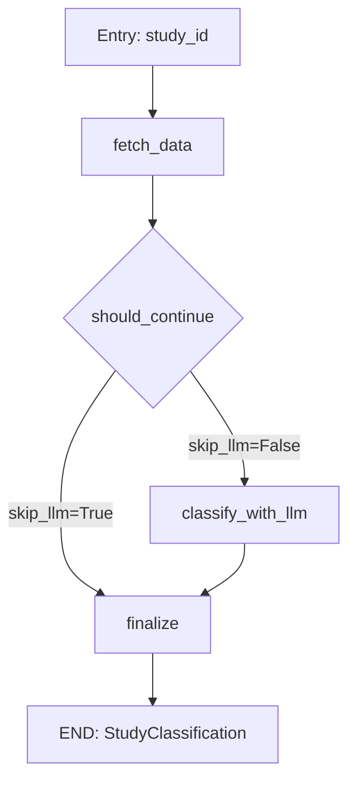

# Agentic Study Classifier: Technical Documentation

## Overview

The **Agentic Study Classifier** is an intelligent agent module that automatically classifies GWAS (Genome-Wide Association Studies) as either **Binary** (case-control design) or **Continuous** (quantitative trait) by fetching real study metadata from the GWAS Catalog REST API and applying multi-level classification strategies.

This module replaces traditional rule-based classifiers with a hybrid approach that combines:
1. **API-based data retrieval** for real-time study metadata
2. **Heuristic pre-classification** for fast, confident decisions
3. **LLM-based classification** for ambiguous cases

## Problem Statement

### The Classification Challenge

When training Polygenic Risk Score (PRS) models, it is critical to correctly identify whether a GWAS study analyzed a **Binary** or **Continuous** trait:

| Trait Type | Statistical Model | Effect Size | Sample Size Metric |
|------------|------------------|-------------|-------------------|
| **Binary** | Logistic Regression | Odds Ratio (OR) | N_cases, N_controls, Neff |
| **Continuous** | Linear Regression | Beta coefficient | Total N |

### The Proxy-GWAS Problem

Traditional keyword-based classifiers fail on **Proxy-GWAS** studies:

```
Study: GCST90012877
Trait: "Alzheimer's disease or family history of Alzheimer's disease"
Sample: "472,868 European ancestry individuals"
```

A naive classifier would see "Alzheimer's disease" and classify as **Binary**. However, this study uses a **Proxy-GWAS** design where family history is treated as a continuous liability score, and the analysis uses **Beta coefficients** (not Odds Ratios).

## Architecture

### System Design

```
┌─────────────────────────────────────────────────────────────────────────────┐
│                        AGENTIC STUDY CLASSIFIER                             │
├─────────────────────────────────────────────────────────────────────────────┤
│                                                                             │
│  ┌─────────────┐    ┌──────────────────────┐    ┌─────────────────────────┐ │
│  │   Input     │───▶│  GWAS Catalog API    │───▶│  Classification Layer  │ │
│  │ (Study ID)  │    │  - Study Metadata    │    │                         │ │
│  │ GCST...     │    │  - Associations*     │    │  ┌─────────────────────┐│ │
│  └─────────────┘    └──────────────────────┘    │  │ Heuristic Classifier││ │
│                              │                   │  │ (Fast, ~0.4s)       ││ │
│                              │                   │  └──────────┬──────────┘│ │
│                              │                   │             │           │ │
│                              │                   │       Confident?       │ │
│                              │                   │        ↙     ↘         │ │
│                              │                   │      Yes       No       │ │
│                              │                   │       ↓         ↓       │ │
│                              │                   │   Return   ┌─────────┐  │ │
│                              │                   │            │   LLM   │  │ │
│                              │                   │            │ (GPT-5) │  │ │
│                              └──────────────────▶│            └────┬────┘  │ │
│                                                  │                 ↓       │ │
│                                                  └─────────────────────────┘ │
│                                                                             │
│  * Associations fetched only when sample description is ambiguous           │
│                                                                             │
├─────────────────────────────────────────────────────────────────────────────┤
│                             OUTPUT (Pydantic)                               │
│  ┌─────────────────────────────────────────────────────────────────────┐    │
│  │ StudyClassification:                                                │    │
│  │   study_id: "GCST90012877"                                          │    │
│  │   trait_type: "Continuous"                                          │    │
│  │   sample_size: 472868                                               │    │
│  │   n_cases: null                                                     │    │
│  │   n_controls: null                                                  │    │
│  │   neff: null                                                        │    │
│  │   ancestry: "EUR"                                                   │    │
│  │   confidence: "high"                                                 │    │
│  │   reasoning: "Beta coefficients indicate continuous analysis"       │    │
│  └─────────────────────────────────────────────────────────────────────┘    │
└─────────────────────────────────────────────────────────────────────────────┘
```

### LangGraph Workflow

The classifier uses a **LangGraph** state machine with the following nodes:



## Core Components

### 1. Pydantic Models (`src/modules/disease/agentic_study_classifier.py`)

```python
class StudyClassification(BaseModel):
    """Structured output for study classification."""
    study_id: str                           # GWAS Catalog accession ID
    trait_type: Literal["Binary", "Continuous"]
    sample_size: int                        # Total N
    n_cases: Optional[int]                  # For Binary traits
    n_controls: Optional[int]               # For Binary traits
    neff: Optional[float]                   # Effective sample size: 4/(1/n_cases + 1/n_controls)
    ancestry: str                           # EUR, AFR, EAS, SAS, AMR
    confidence: Literal["high", "medium", "low"]
    reasoning: str                          # Explanation of decision
```

### 2. GWAS Catalog API Client

Asynchronous client for fetching study metadata:

```python
class GWASCatalogAPIClient:
    BASE_URL = "https://www.ebi.ac.uk/gwas/rest/api"
    
    async def fetch_study_async(study_id, session) -> Dict
    async def fetch_associations_async(study_id, session) -> List[Dict]
```

**Key API Endpoints:**
- `GET /studies/{study_id}` - Study metadata, sample description, trait
- `GET /studies/{study_id}/associations` - Association results with effect types

### 3. Heuristic Pre-Classification

Fast classification based on sample description parsing:

```python
def parse_sample_description(sample_desc: str) -> Dict[str, Any]:
    """
    Pattern 1: "N cases, M controls" → Binary
    Pattern 2: "N individuals" → Continuous
    """
    
def detect_effect_type(associations: List[Dict]) -> Optional[str]:
    """
    Beta values (no OR) → Continuous
    OR values (no Beta) → Binary
    """
```

**Classification Priority:**
1. **Effect Type** (from associations) - Most reliable signal
2. **Sample Description** (cases/controls vs individuals)
3. **Trait Name** (family history, proxy indicators)

### 4. LLM Classification (Fallback)

For ambiguous cases, uses structured output with JSON schema:

```python
SYSTEM_PROMPT = """You are an expert geneticist...

## PRIMARY SIGNAL: Association Effect Type (MOST IMPORTANT!)
- If Beta values are reported → CONTINUOUS (linear regression)
- If OR values are reported → BINARY (logistic regression)

## CRITICAL EXCEPTION
"Family history" studies, "proxy-cases", "GWAX" → CONTINUOUS
"""
```

## Classification Logic

### Decision Tree

```
                    ┌─────────────────────┐
                    │ Fetch Study Data    │
                    │ from GWAS Catalog   │
                    └──────────┬──────────┘
                               │
                    ┌──────────▼──────────┐
                    │ Parse Sample Desc   │
                    │ "N cases, M controls"│
                    │ or "N individuals"? │
                    └──────────┬──────────┘
                               │
              ┌────────────────┴────────────────┐
              │                                 │
     "cases, controls"                   "individuals" only
              │                                 │
              ▼                                 ▼
    ┌─────────────────┐               ┌─────────────────┐
    │ Is Proxy Study? │               │ Return:         │
    │ (family history │               │ Continuous      │
    │  proxy, GWAX)   │               │ confidence=med  │
    └────────┬────────┘               └─────────────────┘
             │
    ┌────────┴────────┐
    │                 │
   Yes               No
    │                 │
    ▼                 ▼
┌────────────┐  ┌────────────────────┐
│ Fetch      │  │ Return: Binary     │
│ Associations│  │ with N_cases,     │
│ Check Beta │  │ N_controls, Neff   │
│ vs OR      │  │ confidence=medium  │
└─────┬──────┘  └────────────────────┘
      │
      ▼
┌─────────────────┐
│ Beta detected?  │
│ → Continuous    │
│ OR detected?    │
│ → Binary        │
│ Ambiguous?      │
│ → Call LLM      │
└─────────────────┘
```

## API Usage

### REST Endpoint

```bash
POST /agent/classify_study
Content-Type: application/json

{
  "study_id": "GCST90012877"
}
```

**Response:**
```json
{
  "study_id": "GCST90012877",
  "trait_type": "Continuous",
  "sample_size": 472868,
  "n_cases": null,
  "n_controls": null,
  "neff": null,
  "ancestry": "EUR",
  "confidence": "high",
  "reasoning": "Association effects use Beta (linear regression), indicating continuous trait analysis"
}
```

### Python API

```python
from src.modules.disease.trait_classifier import classify_study_agentic

# Single study
result = classify_study_agentic("GCST90012877")
print(result["trait_type"])  # "Continuous"

# Batch classification (async)
from src.modules.disease.agentic_study_classifier import classify_studies_batch_async
import asyncio

study_ids = ["GCST90012877", "GCST009979", "GCST007429"]
results = asyncio.run(classify_studies_batch_async(study_ids, max_concurrent=5))
```

## Performance Optimization

### Optimization Strategies

1. **Heuristic Pre-Classification**
   - Skips LLM when sample description is unambiguous
   - Reduces average response time from ~5s to ~0.4s

2. **Conditional API Fetching**
   - Only fetches associations when sample description is ambiguous
   - Reduces API latency from ~5s to ~0.4s

3. **Parallel API Requests**
   - Uses `asyncio.gather()` for concurrent requests
   - Batch processing with semaphore-controlled concurrency

### Performance Benchmarks

| Metric | Value |
|--------|-------|
| Average latency (heuristic) | **0.4s** |
| Average latency (with LLM) | **2-5s** |
| LLM skip rate | ~85% |
| Accuracy (26 test cases) | **100%** |

### Test Results Summary

| Category | Passed | Total | Accuracy |
|----------|--------|-------|----------|
| Binary (case/control) | 10 | 10 | 100% |
| Continuous (individuals) | 16 | 16 | 100% |
| EUR ancestry | 18 | 18 | 100% |
| EAS ancestry | 3 | 3 | 100% |
| AFR ancestry | 1 | 1 | 100% |
| AMR ancestry | 3 | 3 | 100% |
| SAS ancestry | 1 | 1 | 100% |

## File Structure

```
src/modules/disease/
├── agentic_study_classifier.py   # Core classifier implementation
│   ├── StudyClassification       # Pydantic output model
│   ├── GWASCatalogAPIClient      # Async API client
│   ├── parse_sample_description  # Regex-based parser
│   ├── detect_effect_type        # Beta vs OR detection
│   ├── try_heuristic_classification  # Fast classifier
│   ├── fetch_study_data          # LangGraph node
│   ├── classify_with_llm         # LangGraph node
│   └── classify_trait_from_study # Main API function
│
├── trait_classifier.py           # Public interface
│   ├── classify_trait            # Simple keyword-based (legacy)
│   └── classify_study_agentic    # Agentic classifier wrapper
│
└── workflow.py                   # Disease workflow integration
```

## LLM Configuration

All LLM models are configured centrally in `src/core/llm_config.py`. To change model settings:

```python
# src/core/llm_config.py

class LLMConfig:
    # Agentic Study Classifier
    AGENTIC_CLASSIFIER = ModelConfig(
        model="gpt-5-nano",      # Model name
        temperature=0.0,         # Deterministic output
        timeout=60,              # Max wait time (seconds)
        json_mode=True           # Structured JSON output
    )
    
    # Disease Workflow
    DISEASE_WORKFLOW = ModelConfig(
        model="gpt-5-nano",
        temperature=0.0,
        timeout=30
    )
    
    # ... other configurations
```

### Usage in Code

```python
from src.core.llm_config import get_llm

# Get configured LLM instance
llm = get_llm("agentic_classifier")

# Or access raw config
from src.core.llm_config import LLMConfig
config = LLMConfig.AGENTIC_CLASSIFIER
print(f"Model: {config.model}, Temp: {config.temperature}")
```

### Print All Configurations

```bash
python -c "from src.core.llm_config import print_config_summary; print_config_summary()"
```

## Dependencies

```python
# Core
langchain_openai        # LLM integration
langgraph               # State machine workflow
pydantic                # Structured data models
aiohttp                 # Async HTTP client

# Utilities
requests                # Sync HTTP fallback
asyncio                 # Async execution
```

## Configuration

| Variable | Required | Description |
|----------|----------|-------------|
| `OPENAI_API_KEY` | Yes | OpenAI API key for LLM classification |

## Testing

Run the comprehensive test suite:

```bash
cd PennPRS_Agent
export PYTHONPATH=$PYTHONPATH:.
python test_agentic_classifier.py
```

Expected output:
```
AGENTIC STUDY CLASSIFIER - COMPREHENSIVE TEST SUITE
================================================================================
Total test cases: 26

[01/26] Testing GCST009979... PASS | Binary | EUR | N=92,957 | 0.48s
[02/26] Testing GCST009980... PASS | Binary | EUR | N=24,094 | 0.36s
...
[23/26] Testing GCST90012877... PASS | Continuous | EUR | N=472,868 | 0.37s
...

================================================================================
TEST SUMMARY
================================================================================
Passed: 26/26 (100.0%)
Average per study: 2.17s
ALL TESTS PASSED!
```

## Future Improvements

1. **Caching Layer**: Implement Redis/in-memory cache for frequently accessed studies
2. **Batch API Requests**: Use GWAS Catalog batch endpoints for multiple studies
3. **Extended Ancestry Detection**: Support for admixed populations
4. **Meta-analysis Detection**: Identify multi-cohort meta-analysis studies

## References

- GWAS Catalog REST API: https://www.ebi.ac.uk/gwas/rest/docs
- PGS Catalog: https://www.pgscatalog.org
- LangGraph Documentation: https://python.langchain.com/docs/langgraph
- Proxy-GWAS Methodology: Jansen et al., Nature Genetics (2019)

---

*Document Version: 1.0*
*Last Updated: December 26, 2024*
