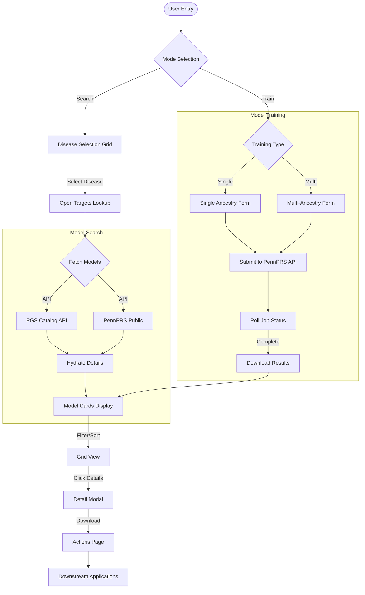

# PennPRS-Disease Technical Documentation

## Overview

The PennPRS-Disease module enables users to search, evaluate, and train Polygenic Risk Score models for disease risk prediction. It provides an intelligent agent workflow that integrates data from PGS Catalog, PennPRS, Open Targets, and GWAS Catalog.

## Architecture

### System Flow

The system follows a multi-step interactive workflow:



### Components

1. **PennPRS Client** (`src/core/pennprs_client.py`): 
   - Communication with PennPRS API for training and public results
   
2. **PGS Catalog Client** (`src/core/pgs_catalog_client.py`): 
   - Fetches metadata from PGS Catalog REST API
   
3. **Open Targets Client** (`src/core/opentargets_client.py`): 
   - Disease/gene ontology search via GraphQL

4. **Workflow Agent** (`src/modules/disease/workflow.py`): 
   - LangGraph state machine orchestrating the workflow

5. **Agentic Classifier** (`src/modules/disease/agentic_study_classifier.py`): 
   - Intelligent GWAS study classification

### Data Flow

1. **User Request**: User selects disease or enters search query
2. **Ontology Mapping**: Open Targets Platform resolves disease to standard IDs
3. **Model Search**: Parallel search across PGS Catalog and PennPRS
4. **Detail Hydration**: Fetch performance metrics for each model
5. **Recommendation**: Agent suggests optimal models based on user criteria
6. **Training (if selected)**: Submit job to PennPRS API and poll for results
7. **Output**: Model cards, detailed reports, download capabilities

## Technical Implementation

### 1. Core Clients

#### PennPRS Client (`src/core/pennprs_client.py`)

```python
class PennPRSClient:
    BASE_URL = "https://pennprs.org/api"
    
    def add_single_job(self, email, job_name, **params) -> str:
        """Submit a training job. Returns job_id."""
        
    def get_jobs(self, email) -> List[Dict]:
        """Get job statuses for an email."""
        
    def download_results(self, job_id) -> bytes:
        """Download completed model results."""
        
    def search_public_results(self, trait) -> List[Dict]:
        """Search public PennPRS models."""
```

#### PGS Catalog Client (`src/core/pgs_catalog_client.py`)

```python
class PGSCatalogClient:
    BASE_URL = "https://www.pgscatalog.org/rest"
    
    def search_scores(self, trait) -> List[Dict]:
        """Search scores from /score/all with client-side filtering."""
        
    def get_score_metadata(self, pgs_id) -> Dict:
        """Fetch detailed metadata for a specific score."""
```

#### Open Targets Client (`src/core/opentargets_client.py`)

```python
class OpenTargetsClient:
    GRAPHQL_URL = "https://api.platform.opentargets.org/api/v4/graphql"
    
    def search_all(self, query, entity_types=None, size=10) -> Dict:
        """Search all entity types (diseases, targets, drugs)."""
        
    def search_grouped(self, query, size=50) -> Dict:
        """Grouped autocomplete search matching platform UI."""
        
    def get_disease_details(self, disease_id) -> Dict:
        """Get detailed disease information."""
```

### 2. Workflow Module (`src/modules/disease/workflow.py`)

**State Definition**:
```python
class AgentState(TypedDict):
    messages: Annotated[list, operator.add]
    next_node: str
    user_intent: str
    selected_trait: str
    selected_model_id: str
    pgs_results: list
    job_config: Dict[str, Any]
    job_id: str
    job_status: str
    result_path: str
    report_data: Report
    structured_response: Dict[str, Any]
    request_id: str
```

**Graph Nodes**:
| Node | Function | Description |
|------|----------|-------------|
| `input_analysis` | Analyze user message | Detect intent and extract parameters |
| `pgs_search` | Search models | Query PGS Catalog and PennPRS |
| `collect_training_info` | Gather training params | Prepare job configuration |
| `submit_training` | Submit to API | Send job to PennPRS |
| `poll_status` | Check job status | Poll until completion |
| `fetch_metadata` | Get model metadata | Retrieve detailed info |
| `deep_fetch_metadata` | Deep hydration | Fetch all performance metrics |
| `download_results` | Download model | Retrieve completed training results |
| `generate_report` | Create report | Generate markdown report |

**Workflow Graph**:
```python
workflow = StateGraph(AgentState)

# Add all nodes
workflow.add_node("input_analysis", input_analysis)
workflow.add_node("pgs_search", pgs_search)
workflow.add_node("collect_training_info", collect_training_info)
workflow.add_node("submit_training", submit_training)
workflow.add_node("poll_status", poll_status)
workflow.add_node("fetch_metadata", fetch_metadata)
workflow.add_node("deep_fetch_metadata", deep_fetch_metadata)
workflow.add_node("download_results", download_results)
workflow.add_node("generate_report", generate_report)

# Set entry point
workflow.set_entry_point("input_analysis")

# Conditional routing based on intent
workflow.add_conditional_edges(
    "input_analysis",
    route_input,
    {
        "pgs_search": "pgs_search",
        "collect_training_info": "collect_training_info",
        "fetch_metadata": "fetch_metadata",
        "deep_fetch_metadata": "deep_fetch_metadata"
    }
)
```

### 3. Agentic Study Classifier

The Agentic Classifier automatically determines whether a GWAS study analyzed a Binary or Continuous trait. See [agentic_study_classifier.md](./agentic_study_classifier.md) for detailed documentation.

**Key Features**:
- Real-time GWAS Catalog API data fetching
- Heuristic pre-classification for fast decisions (~0.4s)
- LLM fallback for ambiguous cases
- 100% accuracy on test suite (26 cases)

### 4. Frontend Components

#### DiseasePage.tsx
Main container with:
- View stack navigation
- Canvas and Chat split layout
- State management for models and training

#### Key Child Components
| Component | Purpose |
|-----------|---------|
| `CanvasArea` | Visual workflow container |
| `DiseaseGrid` | Disease selection cards |
| `ModelGrid` | Model cards with filtering |
| `SearchSummaryView` | Statistics and charts |
| `ModelDetailModal` | Full model details |
| `TrainingConfigForm` | Single ancestry training |
| `MultiAncestryTrainingForm` | Multi-ancestry training |
| `GWASSearchModal` | Open Targets search modal |

### 5. API Integration

#### PennPRS API
- **Base URL**: `https://pennprs.org/api`
- **Authentication**: Email-based
- **Endpoints**:
  - `POST /add_job/single` - Submit single training job
  - `GET /jobs/{email}` - Get job statuses
  - `GET /download/{job_id}` - Download results
  - `GET /results_meta_data.json` - Public results metadata

#### PGS Catalog API
- **Base URL**: `https://www.pgscatalog.org/rest`
- **Authentication**: None (public)
- **Endpoints**:
  - `GET /score/all` - All scores (paginated)
  - `GET /score/{id}` - Score details
  - `GET /trait/all` - All traits

#### Open Targets GraphQL
- **URL**: `https://api.platform.opentargets.org/api/v4/graphql`
- **Authentication**: None (public)
- **Queries**: `searchAll`, `disease`, `target`

## Configuration

| Variable | Required | Description |
|----------|----------|-------------|
| `OPENAI_API_KEY` | Yes | OpenAI API key for LLM |
| `PENNPRS_EMAIL` | No | Default email for PennPRS jobs |

### LLM Configuration

All LLM models are configured in `src/core/llm_config.py`:

```python
from src.core.llm_config import get_llm

# Available configurations
llm = get_llm("disease_workflow")      # Main workflow
llm = get_llm("agentic_classifier")    # Study classifier
```

## Testing

```bash
# Unit tests
pytest tests/unit/test_pennprs_client.py -v
pytest tests/unit/test_pgs_catalog_client.py -v
pytest tests/unit/test_opentargets_client.py -v
pytest tests/unit/test_agentic_classifier.py -v

# Integration tests
pytest tests/integration/test_pennprs_api_real.py -v
pytest tests/integration/test_pgs_catalog_api_real.py -v
```

## Performance Metrics

| Operation | Typical Duration |
|-----------|------------------|
| Model Search (100 models) | 15-30 seconds |
| Detail Hydration (per model) | 0.5-1 second |
| Study Classification (heuristic) | 0.4 seconds |
| Study Classification (with LLM) | 2-5 seconds |

## Future Enhancements

1. **Model Ensemble**: Combine multiple PRS models
2. **Benchmarking Integration**: Connect to evaluation tools
3. **Batch Training**: Submit multiple training jobs
4. **Advanced Filtering**: ML-powered recommendation
5. **Export Capabilities**: PDF reports, data export

## References

- PGS Catalog: https://www.pgscatalog.org/
- PennPRS: https://pennprs.org/
- Open Targets Platform: https://platform.opentargets.org/
- GWAS Catalog: https://www.ebi.ac.uk/gwas/
- LangGraph: https://python.langchain.com/docs/langgraph

---

*Document Version: 2.0*
*Last Updated: 2026-01-08*
