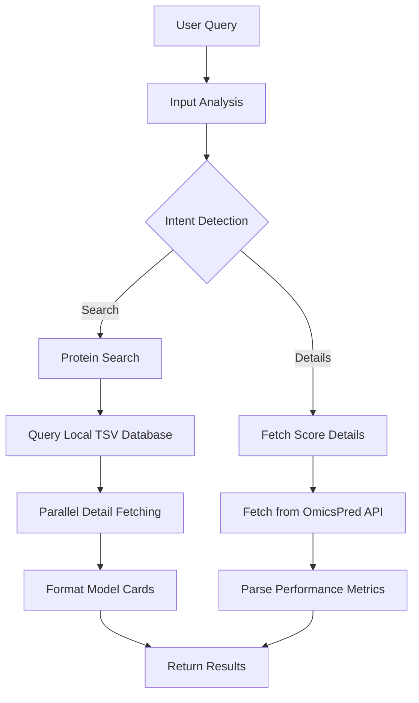

# PennPRS-Protein Technical Documentation

## Overview

The PennPRS-Protein module enables users to search and explore proteomics genetic scores from the OmicsPred database. This module predicts protein expression levels from genetic data, leveraging a comprehensive atlas of ~304,000 multi-omics genetic scores.

## Data Source: OmicsPred

**OmicsPred** (https://www.omicspred.org/) is an atlas of genetic scores for predicting multi-omics data, including:
- **Proteomics**: Protein expression levels
- **Metabolomics**: Metabolite concentrations
- **Transcriptomics**: Gene expression levels

### Key Statistics

| Metric | Value |
|--------|-------|
| Total Scores | ~304,391 |
| Platforms | 15+ (Olink, SomaScan, etc.) |
| Primary Training Cohort | INTERVAL |
| Genome Build | GRCh37 |

## Architecture

### System Flow



### Components

1. **Local Data Client** (`src/core/omicspred_client.py`): 
   - Loads and queries the local TSV database
   - Fetches detailed metrics from OmicsPred API
   - Formats results for UI consumption

2. **Workflow Agent** (`src/modules/protein/workflow.py`):
   - LangGraph state machine for orchestrating the workflow
   - Handles intent detection and routing

3. **Frontend Page** (`frontend/components/ProteinPage.tsx`):
   - React component for the protein module interface
   - Includes score cards, platform filters, and detail modals

## Data Flow

### Search Flow

1. **User Query**: User searches for a protein (e.g., "APOE", "insulin")
2. **Local Search**: Query the `omicspred_scores_full.tsv` file
3. **Result Filtering**: Apply platform and other filters
4. **Detail Hydration**: Fetch R²/Rho metrics via parallel API calls
5. **Card Formatting**: Convert to UI-friendly model card format
6. **Display**: Show sorted results in the frontend

### Data Schema

The local database (`data/omicspred/omicspred_scores_full.tsv`) contains 34 columns. Key fields:

| Column | Description |
|--------|-------------|
| `id` | Global unique identifier (e.g., OPGS000001) |
| `name` | Score model name |
| `trait_reported` | Protein/metabolite name |
| `trait_reported_id` | External ID (e.g., UniProt) |
| `method_name` | Statistical training method |
| `variants_number` | Number of SNPs in model |
| `study_train_n` | Training sample size |
| `platform_name` | Instrument/Assay provider |
| `genes_names` | Associated gene symbols |
| `proteins_names` | Full protein name |

See [OMICSPRED_TSV_SCHEMA.md](../data/OMICSPRED_TSV_SCHEMA.md) for complete schema.

## Technical Implementation

### 1. OmicsPred Client (`src/core/omicspred_client.py`)

```python
class OmicsPredClient:
    """Client for querying local OmicsPred dataset."""
    
    def load_data(self) -> None:
        """Lazy load the TSV dataset into memory."""
        
    def search_scores_general(self, term: str, limit: int = 5000) -> List[Dict]:
        """General search across protein names, genes, and traits."""
        
    def get_scores_by_platform(self, platform: str, max_results: int = 10000) -> List[Dict]:
        """Filter scores by proteomics platform."""
        
    def get_score_details(self, score_id: str) -> Dict:
        """Fetch detailed performance metrics from OmicsPred API."""
        
    def list_platforms(self) -> List[Tuple[str, int]]:
        """List available platforms with score counts."""
        
    def format_score_for_ui(self, score: Dict, details: Dict = None) -> Dict:
        """Transform raw data to frontend-compatible format."""
```

### 2. Workflow Module (`src/modules/protein/workflow.py`)

**State Definition**:
```python
class ProteinAgentState(TypedDict):
    messages: Annotated[list, operator.add]
    next_node: str
    user_intent: str
    selected_protein: str
    selected_platform: str
    selected_model_id: str
    protein_results: list
    structured_response: Dict[str, Any]
    request_id: str
```

**Graph Nodes**:
- `input_analysis`: Analyze user message and detect intent
- `protein_search`: Execute search and hydrate results
- `fetch_score_details`: Get details for a specific score

**Routing Logic**:
```python
def route_input(state):
    return state.get("next_node", "protein_search")

workflow.add_conditional_edges(
    "input_analysis",
    route_input,
    {
        "protein_search": "protein_search",
        "fetch_score_details": "fetch_score_details"
    }
)
```

### 3. API Integration

**OmicsPred Public API**:
```
Base URL: https://www.omicspred.org/api/scores/
Endpoint: GET /{score_id}
Response: Score metadata (methods, cohorts, etc.)
```

**OmicsPred Performance API** (Reverse-engineered):
```
Base URL: https://www.omicspred.org/api/charts/single_score/
Endpoint: GET /{score_id}/performance/
Response: R², Rho values per validation cohort
```

## Frontend Components

### ProteinPage.tsx

Main container component with:
- Platform selection grid
- Search input
- Progress tracking
- Results display

### ProteinScoreCard

Displays individual score cards with:
- Protein name and gene symbol
- Platform badge
- Performance metrics (R², Rho)
- Sample size
- Quick actions

### ProteinDetailModal

Full-detail modal showing:
- Complete metadata
- Performance breakdown by cohort
- Gene/protein associations
- External links (UniProt, Ensembl)

## Performance Optimization

### Local Data Loading

The TSV file (~185MB) is loaded lazily on first query:
```python
def load_data(self):
    if self._data_loaded:
        return
    self.df = pd.read_csv(DATA_PATH, sep='\t', low_memory=False)
    self._data_loaded = True
```

### Parallel Detail Fetching

Score details are fetched in parallel using ThreadPoolExecutor:
```python
with concurrent.futures.ThreadPoolExecutor(max_workers=10) as executor:
    futures = {executor.submit(fetch_single_detail, item): item for item in items}
    for future in concurrent.futures.as_completed(futures):
        result = future.result()
        if result:
            detailed_results.append(result)
```

### Progress Tracking

Real-time progress is exposed via the state store:
```python
search_progress[request_id] = {
    "status": "running",
    "total": total_count,
    "fetched": current_count,
    "current_action": "Fetching score details..."
}
```

## Configuration

| Variable | Required | Description |
|----------|----------|-------------|
| `OPENAI_API_KEY` | Yes | For LLM intent detection |

## Testing

```bash
# Run unit tests
pytest tests/unit/test_omicspred_client.py -v

# Test API endpoints
curl http://localhost:8000/protein/platforms
curl -X POST http://localhost:8000/protein/invoke \
  -H "Content-Type: application/json" \
  -d '{"message": "Search for APOE protein scores"}'
```

## Future Enhancements

1. **Custom Training**: Allow users to train protein genetic scores via PennPRS
2. **Metabolomics Focus**: Dedicated metabolomics search workflow
3. **Multi-Score Ensemble**: Combine multiple protein scores
4. **Pathway Enrichment**: Map protein scores to biological pathways
5. **Caching Layer**: Redis cache for frequently accessed scores

## References

- OmicsPred: https://www.omicspred.org/
- OmicsPred Paper: Sun et al., Nature Genetics (2023)
- INTERVAL Cohort: Moore et al., European Journal of Epidemiology (2014)

---

*Document Version: 1.0*
*Last Updated: 2026-01-08*
